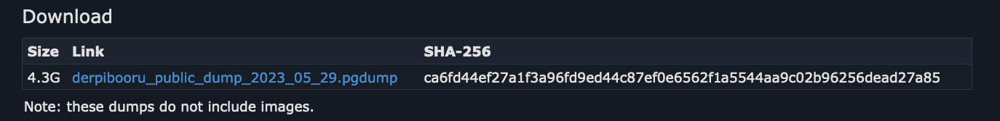

class: middle, center

# Derpibooru in Numbers

.image50[]

---

# About me

.left-column[

- Brony since 2013
- Furry since... later
- From Cologne
- Software Engineer
- Working with Android
- Wanna-Be Datascientist
  ]
  .right-column[.image100[]]

---

# About derpibooru

- Image sharing website (image booru)
- First upload: 02.01.2012
- Also includes forums and a commission page

.center[.image80[]]

---

# A small but needed disclaimer

### I do not endorse derpibooru

- provides easy access to metadata via database dumps
- to my knowledge the biggest collection of mlp images
- Shrouded in various controversies
- Just use manebooru.art instead
- This is a fun statistics and history project

---

# So how does one start analyzing?

.center[.image80[]]

---

# Option One

## Do it manually

--
.center[.image80[]]

--
.center[.image80[]]

--
.center[.image80[]]

---

# Option Two

## Pray to the API Gods

`https://derpibooru.org/images/1449334`
`https://derpibooru.org/api/v1/json/images/1449334`

---
count: false

# Option Two

.center[.image450px[]]

---
count: false

# Option Two

.center[.image80[]]

---

# Option Three

## Just download the entire database

`https://derpibooru.org/pages/data_dumps`

--

.image100[]

???
- Just download it
- And set up a database
- and import everything
- and fix errors
- and fight docker on apple silicon
- It took me about 4 hours

---

# Success

.image100[]

---

# Let's do some science

```SQL
SELECT intersting_analytics
from derpibooru;
```

--
.red.bold[[42P01] ERROR: relation "derpibooru" does not exist]

--

.image50[]

---

# Let's do some more science

```sql
select tag_id, name, count
from (select count(1) as count, tag_id
      from images
               join image_taggings it on images.id = it.image_id
               join tags t on it.tag_id = t.id
      where category = 'character'
      group by tag_id) as tag_count
         join tags on tag_count.tag_id = tags.id
order by count desc;
```

---

# Let's do some more science

.left-column[

|  #  |       name        |  count  |
|:---:|:-----------------:|:-------:|
|  1  | twilight sparkle  | 385.404 |
|  2  |   rainbow dash    | 299.140 |
|  3  |    fluttershy     | 274.734 |
|  4  |    pinkie pie     | 273.756 |
|  5  |      rarity       | 234.390 |
|  6  |     applejack     | 215.989 |
|  7  |   princess luna   | 125.722 |
|  8  | princess celestia | 122.372 |
|  9  |       spike       | 101.369 |
| 10  |      trixie       | 86.427  |

]

.right-column[

|  #  |       name        | count  |
|:---:|:-----------------:|:------:|
| 11  |  sunset shimmer   | 85.092 |
| 12  |     scootaloo     | 65.186 |
| 13  |    apple bloom    | 64.926 |
| 14  | starlight glimmer | 62.814 |
| 15  |   derpy hooves    | 62.715 |
| 16  |   sweetie belle   | 62.044 |
| 17  |  queen chrysalis  | 45.083 |
| 18  | princess cadance  | 42.933 |
| 19  |      discord      | 40.142 |
| 20  | lyra heartstrings | 37.110 |

]

???
7% of all pictures contain twilight

---

# Let's do some more science G5 Edition

| #   |       name        | count  |
|-----|:-----------------:|--------|
| 36  |   izzy moonbow    | 16.763 |
| 37  |   flash sentry    | 16.588 |
| 38  |     maud pie      | 15.825 |
| 39  |  sunny starscout  | 15.761 |
| 40  |    pipp petals    | 14.867 |
| 53  | hitch trailblazer | 10.087 |
| 155 | sprout cloverleaf | 2.313  |

---
# Talking about tags

.image100[]

???
The image tag section. Relates similar picture for searching
---
# Talking about tags

.image100[]
???
Rating shows whether or not a picture is sfw
---
# Talking about tags

.image100[]
???
Artist
---
# Talking about tags

.image100[]
???
Character
---
# Talking about tags

.image100[]
???
Species
---
# Talking about tags

.image100[]
???
All of the rest like colouring, pose, specifics about the characters, number of characters, asscociated meme

---
# Most used tags

.left-column[

| #   | name                   | count     |
|:----|:-----------------------|:----------|
| 1   | safe                   | 2,240,831 |
| 2   | female                 | 1,733,555 |
| 3   | pony                   | 1,453,306 |
| 4   | solo                   | 1,420,231 |
| 5   | oc                     | 945,168   |
| 6   | oc only                | 679,532   |
| 7   | mare                   | 676,629   |
| 8   | clothes                | 627,939   |
| 9   | simple background      | 566,333   |
| 10  | nudity                 | 518,003   |

]

.right-column[

| #   | name                   | count     |
|:----|:-----------------------|:----------|
| 11  | male                   | 511,549   |
| 12  | unicorn                | 499,016   |
| 13  | pegasus                | 454,320   |
| 14  | earth pony             | 404,475   |
| 15  | twilight sparkle       | 382,305   |
| 16  | smiling                | 374,632   |
| 17  | anthro                 | 363,840   |
| 18  | alicorn                | 305,071   |
| 19  | rainbow dash           | 296,114   |
| 20  | screencap              | 290,528   |

]

---
# Body Types

---
count:false
# Body Types

.left-column[

| #   | name                    | count  |
|:----|:------------------------|:-------|
| 1   | unguligrade anthro      | 65,584 |

]

.right-column[.image80[]]

???
pony legs and hooves

---
count:false
# Body Types

.left-column[

| #   | name                    | count  |
|:----|:------------------------|:-------|
| 1   | unguligrade anthro      | 65,584 |
| 2   | plantigrade anthro      | 48,277 |

]

.right-column[.image80[]]

???
hooman legs and hooman feet

---
count:false
# Body Types
.center[.image60[]]

---
count:false
# Body Types

.left-column[

| #   | name                    | count  |
|:----|:------------------------|:-------|
| 1   | unguligrade anthro      | 65,584 |
| 2   | plantigrade anthro      | 48,277 |
| 3   | semi-anthro             | 21,525 |

]

.right-column[.image60[]]

???
No human features

---
count:false
# Body Types

.left-column[

| #   | name                    | count  |
|:----|:------------------------|:-------|
| 1   | unguligrade anthro      | 65,584 |
| 2   | plantigrade anthro      | 48,277 |
| 3   | semi-anthro             | 21,525 |
| 4   | digitigrade anthro      | 2,800  |

]

.right-column[.image80[]]

???
Anthro walking on toes e.g cappa

---
count:false
# Body Types

.left-column[

| #   | name                    | count  |
|:----|:------------------------|:-------|
| 1   | unguligrade anthro      | 65,584 |
| 2   | plantigrade anthro      | 48,277 |
| 3   | semi-anthro             | 21,525 |
| 4   | digitigrade anthro      | 2,800  |
| 5   | taur                    | 1,973  |

]

.right-column[.image80[]]

???
taurus e.g. tirek


---
count:false
# Body Types

.left-column[

| #   | name                    | count  |
|:----|:------------------------|:-------|
| 1   | unguligrade anthro      | 65,584 |
| 2   | plantigrade anthro      | 48,277 |
| 3   | semi-anthro             | 21,525 |
| 4   | digitigrade anthro      | 2,800  |
| 5   | taur                    | 1,973  |
| 6   | human head pony         | 145    |

]

.right-column[.image80[]]

---
count:false
# Body Types

.left-column[

| #   | name                    | count  |
|:----|:------------------------|:-------|
| 1   | unguligrade anthro      | 65,584 |
| 2   | plantigrade anthro      | 48,277 |
| 3   | semi-anthro             | 21,525 |
| 4   | digitigrade anthro      | 2,800  |
| 5   | taur                    | 1,973  |
| 6   | human head pony         | 145    |
| 7   | two legged creature     | 75     |

]

.right-column[.image80[]]

---
count:false
# Body Types

.left-column[

| #   | name                    | count  |
|:----|:------------------------|:-------|
| 1   | unguligrade anthro      | 65,584 |
| 2   | plantigrade anthro      | 48,277 |
| 3   | semi-anthro             | 21,525 |
| 4   | digitigrade anthro      | 2,800  |
| 5   | taur                    | 1,973  |
| 6   | human head pony         | 145    |
| 7   | two legged creature     | 75     |
| 8   | pony head on human body | 62     |

]

---
count:false
# Body Types

.center[.image100[]]

---
count:false
# Body Types

.left-column[

| #   | name                    | count  |
|:----|:------------------------|:-------|
| 1   | unguligrade anthro      | 65,584 |
| 2   | plantigrade anthro      | 48,277 |
| 3   | semi-anthro             | 21,525 |
| 4   | digitigrade anthro      | 2,800  |
| 5   | taur                    | 1,973  |
| 6   | human head pony         | 145    |
| 7   | two legged creature     | 75     |
| 8   | pony head on human body | 62     |
| 9   | kemonomimi              | 53     |

]

.right-column[.image80[]]

???
human with limited animal features

search site looks similar to plantigrade_anthro


---
count:false
# Body Types

.left-column[

| #   | name                    | count  |
|:----|:------------------------|:-------|
| 1   | unguligrade anthro      | 65,584 |
| 2   | plantigrade anthro      | 48,277 |
| 3   | semi-anthro             | 21,525 |
| 4   | digitigrade anthro      | 2,800  |
| 5   | taur                    | 1,973  |
| 6   | human head pony         | 145    |
| 7   | two legged creature     | 75     |
| 8   | pony head on human body | 62     |
| 9   | kemonomimi              | 53     |
| 10  | probably not salmon     | 49     |

]

---
count:false
# Body Types

.center[.image60[]]

???
Derpibooru description:
but you can tell it’s not salmon… probably

---
# Tags
## Most tagged image

--
.center[.image80[]]

---
count:false

# Tags
## Most tagged image

.center[.image80[]]

---
count:false

# Tags
## Most tagged image

.center[.image80[]]

---
count:false

# Tags
## Most tagged image

.center[.image80[]]

???
Rule 5: Do not post forbidden content

---
count:false

# Tags
## Most tagged image

.center[
### 2231725
]


---
count:false

# Tags
## Most tagged image

.center[.image80[]]

???
Derpibooru Community Colab 2020

---
# Tag Edits
## 14,351


]]

---
# Tag Edits
## 75,260
.center[.image80[]]

---
# Tag Edits
## But Why?
- Average: 11 edits per Image
- 99.91% of images have less than 100 edits