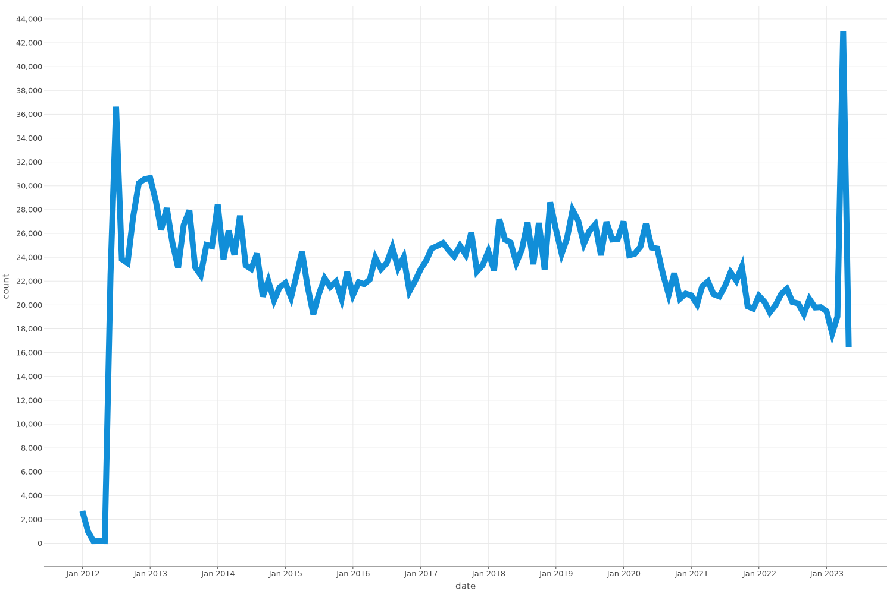
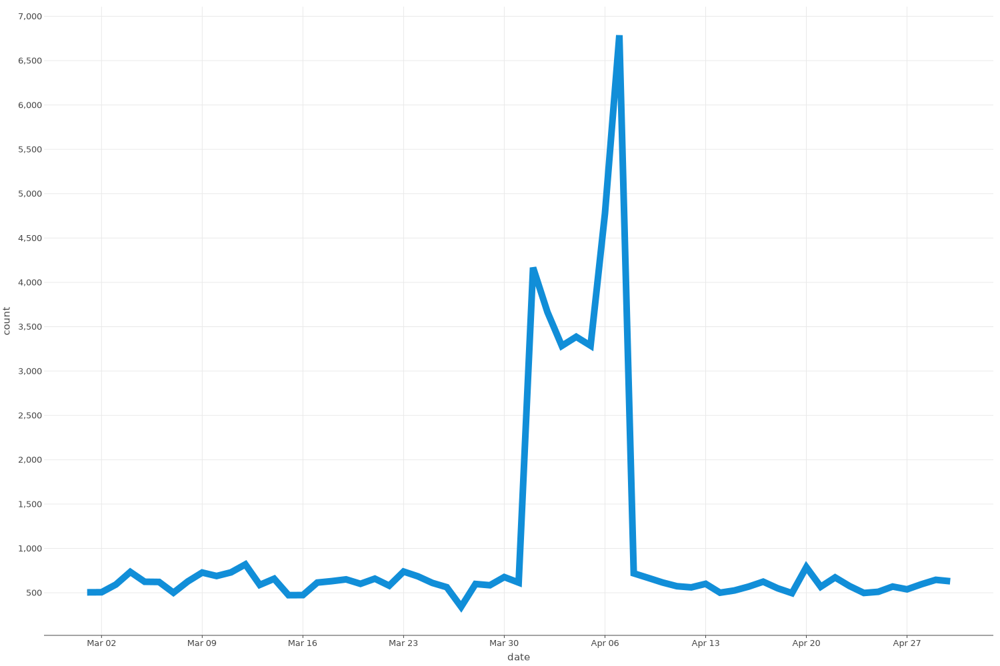

class: middle, center

# Derpibooru in Numbers

.image50[]

---

# Content Warning

.center[**This panel contains mention of not safe for work content and themes, as well as mild swearing**]

???
Questions are fine during the talk

---

# About me

.left-column[

- Brony since 2013
- Furry since... later
- Hailing from Cologne
- Software Engineer
- Working with Android
- Wanna-Be Datascientist
  ]
  .right-column[.image100[]]

???
Thanks to luna
- she
- pinged me a week ago
- current "CEO" of derpibooru
- provided some information and super secret statistics

---

# About derpibooru

- Image sharing website (image booru)
- First upload: 02.01.2012
- Also includes forums and a commission page
- Around 1.000.000 unique visitors a month
- Over 100 TB of data transferred per month
- majority of images served are png
  - jpeg
  - svg
  - gif
- Majority of users from the USA
  - not so closely followed by Russia, China and the UK

???
- ratio png to jpeg -> 100%
- ratio jpeg to svg -> 100%

---
# About derpibooru

.center[.image80[]]

---

# About datascience

- Gathering knowledge from datasets
- Closely related to computer science and statistics
- Found knowledge used to predict future events

---

# So how does one start analyzing?

.center[.image80[]]

---

# Option One

## Do it manually

???
In derpiboorus footer find the Statistics

--
.center[.image80[]]

--
.center[.image80[]]

--
.center[.image80[]]

---

# Option Two

## Pray to the API Gods

`https://derpibooru.org/images/1449334`

--

`https://derpibooru.org/api/v1/json/images/1449334`

---
count: false

# Option Two

.center[.image450px[]]

---
count: false

# Option Two

.center[.image80[]]

---

# Option Three

## Just download the entire database

`https://derpibooru.org/pages/data_dumps`

--

.image100[]

???

- Just download it
- And set up a database
- and import everything
- and fix errors
- and fight docker on apple silicon
- It took me about 4 hours
- Data back from Mai 2023

---

# Success

.image100[]

---

# Let's do some science

```SQL
SELECT intersting_analytics
from derpibooru;
```

--
.red.bold[[42P01] ERROR: relation "derpibooru" does not exist]

--

.image50[]

---

# Let's do some more science

```sql
select tag_id, name, count
from (select count(1) as count, tag_id
      from images
               join image_taggings it on images.id = it.image_id
               join tags t on it.tag_id = t.id
      where category = 'character'
      group by tag_id) as tag_count
         join tags on tag_count.tag_id = tags.id
order by count desc;
```

---

# Let's do some more science

.left-column[

|  #  |       name        |  count  |
|:---:|:-----------------:|:-------:|
|  1  | twilight sparkle  | 385.404 |
|  2  |   rainbow dash    | 299.140 |
|  3  |    fluttershy     | 274.734 |
|  4  |    pinkie pie     | 273.756 |
|  5  |      rarity       | 234.390 |
|  6  |     applejack     | 215.989 |
|  7  |   princess luna   | 125.722 |
|  8  | princess celestia | 122.372 |
|  9  |       spike       | 101.369 |
| 10  |      trixie       | 86.427  |

]

.right-column[

|  #  |       name        | count  |
|:---:|:-----------------:|:------:|
| 11  |  sunset shimmer   | 85.092 |
| 12  |     scootaloo     | 65.186 |
| 13  |    apple bloom    | 64.926 |
| 14  | starlight glimmer | 62.814 |
| 15  |   derpy hooves    | 62.715 |
| 16  |   sweetie belle   | 62.044 |
| 17  |  queen chrysalis  | 45.083 |
| 18  | princess cadance  | 42.933 |
| 19  |      discord      | 40.142 |
| 20  | lyra heartstrings | 37.110 |

]

???
7% of all pictures contain twilight

---

# Let's do some more science G5 Edition

| #   |       name        | count  |
|-----|:-----------------:|--------|
| 36  |   izzy moonbow    | 16.763 |
| 37  |   flash sentry    | 16.588 |
| 38  |     maud pie      | 15.825 |
| 39  |  sunny starscout  | 15.761 |
| 40  |    pipp petals    | 14.867 |
| 53  | hitch trailblazer | 10.087 |
| 155 | sprout cloverleaf | 2.313  |

---
# Let's start at the start

.center[.image60[]]

---
# Let's start at the start

.center[.image60[]]

???

- Not much interesting
- Maybe filters

---

# All the scores

.center[.image60[]]

---

# Most Favourites

--

.center[.image100[]]

---

# 2nd Most Favourites

--

.center[.image100[]]

---

# 4th Most Favourites

.center[.image100[]]

???
marminatoror

---

# Most upvotes

???
Same as most favourites

--

.center[.image40[]]

---

# Most downvotes

???
- did not want to show this

--

.center[.image100[]]

???
- dynamic pose
- op is a duck
- duckery in the source
- op is trying to start shit
- op started shit
- pure unfiltered evil
- what the fuck did you just bring upon this cursed land

---
# Most controversial image
- score (upvotes - downvotes) close to 0
- absolute number of votes as high as possible

--
- surprisingly united

???
Mostly unpopular kinks or gore

--
.center[.image75[]]

---
# Metadata

.center[.image60[]]

---

# ImagesOverTime

.center[.image100[]]

---

# ImagesOverTime

.center[.image100[]]

---

# Smallest Picture

--

.center[.image75[]]

???
- 5x5 pixel
- 89 Bytes

---

# Smallest Picture

.center[.image50[]]

---
# Biggest Picture
- No Videos or Animations
- Largest by Filesize

???
- 101,331,051 bytes
- 4670x6000

---

# Biggest Picture

.center[.image50[]]

---

# Biggest Picture
.center[.image450px[]]

???
-96,97 mb
- 18000x12000

---

# Biggest Picture
.center[.image450px[]]

???
- 1,464,800,000 pixels
- "all pictures of big mac must be BIG!!!"

---

# Talking about tags

.image100[]

???
The image tag section. Relates similar picture for searching
---

# Talking about tags

.image100[]
???
Rating shows whether a picture is sfw
---

# Talking about tags

.image100[]
???
Artist
---

# Talking about tags

.image100[]
???
Character
---

# Talking about tags

.image100[]
???
Species
---

# Talking about tags

.image100[]
???
All of the rest like colouring, pose, specifics about the characters, number of characters, asscociated meme

---

# Talking about tags

.image100[]

---

# Most used tags

.left-column[

| #   | name              | count     |
|:----|:------------------|:----------|
| 1   | safe              | 2,240,831 |
| 2   | female            | 1,733,555 |
| 3   | pony              | 1,453,306 |
| 4   | solo              | 1,420,231 |
| 5   | oc                | 945,168   |
| 6   | oc only           | 679,532   |
| 7   | mare              | 676,629   |
| 8   | clothes           | 627,939   |
| 9   | simple background | 566,333   |
| 10  | nudity            | 518,003   |

]

.right-column[

| #   | name             | count   |
|:----|:-----------------|:--------|
| 11  | male             | 511,549 |
| 12  | unicorn          | 499,016 |
| 13  | pegasus          | 454,320 |
| 14  | earth pony       | 404,475 |
| 15  | twilight sparkle | 382,305 |
| 16  | smiling          | 374,632 |
| 17  | anthro           | 363,840 |
| 18  | alicorn          | 305,071 |
| 19  | rainbow dash     | 296,114 |
| 20  | screencap        | 290,528 |

]

---
count:false

# Most used tags

.left-column[

| #   | name              | count     |
|:----|:------------------|:----------|
| 1   | safe              | 2,240,831 |
| 2   | **female**        | 1,733,555 |
| 3   | pony              | 1,453,306 |
| 4   | solo              | 1,420,231 |
| 5   | oc                | 945,168   |
| 6   | oc only           | 679,532   |
| 7   | mare              | 676,629   |
| 8   | clothes           | 627,939   |
| 9   | simple background | 566,333   |
| 10  | nudity            | 518,003   |

]

.right-column[

| #   | name             | count   |
|:----|:-----------------|:--------|
| 11  | **male**         | 511,549 |
| 12  | unicorn          | 499,016 |
| 13  | pegasus          | 454,320 |
| 14  | earth pony       | 404,475 |
| 15  | twilight sparkle | 382,305 |
| 16  | smiling          | 374,632 |
| 17  | anthro           | 363,840 |
| 18  | alicorn          | 305,071 |
| 19  | rainbow dash     | 296,114 |
| 20  | screencap        | 290,528 |

]

---
count:false

# Most used tags

.left-column[

| #   | name              | count     |
|:----|:------------------|:----------|
| 1   | safe              | 2,240,831 |
| 2   | female            | 1,733,555 |
| 3   | pony              | 1,453,306 |
| 4   | solo              | 1,420,231 |
| 5   | oc                | 945,168   |
| 6   | oc only           | 679,532   |
| 7   | mare              | 676,629   |
| 8   | clothes           | 627,939   |
| 9   | simple background | 566,333   |
| 10  | nudity            | 518,003   |

]

.right-column[

| #   | name             | count   |
|:----|:-----------------|:--------|
| 11  | male             | 511,549 |
| 12  | **unicorn**      | 499,016 |
| 13  | **pegasus**      | 454,320 |
| 14  | **earth pony**   | 404,475 |
| 15  | twilight sparkle | 382,305 |
| 16  | smiling          | 374,632 |
| 17  | anthro           | 363,840 |
| 18  | alicorn          | 305,071 |
| 19  | rainbow dash     | 296,114 |
| 20  | screencap        | 290,528 |

]

---
count:false

# Most used tags

.left-column[

| #   | name              | count     |
|:----|:------------------|:----------|
| 1   | safe              | 2,240,831 |
| 2   | female            | 1,733,555 |
| 3   | pony              | 1,453,306 |
| 4   | solo              | 1,420,231 |
| 5   | oc                | 945,168   |
| 6   | oc only           | 679,532   |
| 7   | mare              | 676,629   |
| 8   | **clothes**       | 627,939   |
| 9   | simple background | 566,333   |
| 10  | **nudity**        | 518,003   |

]

.right-column[

| #   | name             | count   |
|:----|:-----------------|:--------|
| 11  | male             | 511,549 |
| 12  | unicorn          | 499,016 |
| 13  | pegasus          | 454,320 |
| 14  | earth pony       | 404,475 |
| 15  | twilight sparkle | 382,305 |
| 16  | smiling          | 374,632 |
| 17  | anthro           | 363,840 |
| 18  | alicorn          | 305,071 |
| 19  | rainbow dash     | 296,114 |
| 20  | screencap        | 290,528 |

]

---

# Body Types

.center[.image100[]]

???

- pony is not considered a body type
- anthro is, but almost all other body types imply it

---
count:false

# Body Types

.left-column[

| #   | name               | count  |
|:----|:-------------------|:-------|
| 1   | unguligrade anthro | 65,584 |

]

.right-column[.image80[]]

???
pony legs and hooves

---
count:false

# Body Types

.left-column[

| #   | name               | count  |
|:----|:-------------------|:-------|
| 1   | unguligrade anthro | 65,584 |
| 2   | plantigrade anthro | 48,277 |

]

.right-column[.image80[]]

???
hooman legs and hooman feet

---
count:false

# Body Types

.center[.image60[]]

---
count:false

# Body Types

.left-column[

| #   | name               | count  |
|:----|:-------------------|:-------|
| 1   | unguligrade anthro | 65,584 |
| 2   | plantigrade anthro | 48,277 |
| 3   | semi-anthro        | 21,525 |

]

.right-column[.image60[]]

???
No human features

---
count:false

# Body Types

.left-column[

| #   | name               | count  |
|:----|:-------------------|:-------|
| 1   | unguligrade anthro | 65,584 |
| 2   | plantigrade anthro | 48,277 |
| 3   | semi-anthro        | 21,525 |
| 4   | digitigrade anthro | 2,800  |

]

.right-column[.image80[]]

???
Anthro walking on toes e.g cappa

---
count:false

# Body Types

.left-column[

| #   | name               | count  |
|:----|:-------------------|:-------|
| 1   | unguligrade anthro | 65,584 |
| 2   | plantigrade anthro | 48,277 |
| 3   | semi-anthro        | 21,525 |
| 4   | digitigrade anthro | 2,800  |
| 5   | taur               | 1,973  |

]

.right-column[.image80[]]

???
taurus e.g. tirek


---
count:false

# Body Types

.left-column[

| #   | name               | count  |
|:----|:-------------------|:-------|
| 1   | unguligrade anthro | 65,584 |
| 2   | plantigrade anthro | 48,277 |
| 3   | semi-anthro        | 21,525 |
| 4   | digitigrade anthro | 2,800  |
| 5   | taur               | 1,973  |
| 6   | human head pony    | 145    |

]

.right-column[.image80[]]

---
count:false

# Body Types

.left-column[

| #   | name                | count  |
|:----|:--------------------|:-------|
| 1   | unguligrade anthro  | 65,584 |
| 2   | plantigrade anthro  | 48,277 |
| 3   | semi-anthro         | 21,525 |
| 4   | digitigrade anthro  | 2,800  |
| 5   | taur                | 1,973  |
| 6   | human head pony     | 145    |
| 7   | two legged creature | 75     |

]

.right-column[.image80[]]

---
count:false

# Body Types

.left-column[

| #   | name                    | count  |
|:----|:------------------------|:-------|
| 1   | unguligrade anthro      | 65,584 |
| 2   | plantigrade anthro      | 48,277 |
| 3   | semi-anthro             | 21,525 |
| 4   | digitigrade anthro      | 2,800  |
| 5   | taur                    | 1,973  |
| 6   | human head pony         | 145    |
| 7   | two legged creature     | 75     |
| 8   | pony head on human body | 62     |

]

---
count:false

# Body Types

.center[.image100[]]

---
count:false

# Body Types

.left-column[

| #   | name                    | count  |
|:----|:------------------------|:-------|
| 1   | unguligrade anthro      | 65,584 |
| 2   | plantigrade anthro      | 48,277 |
| 3   | semi-anthro             | 21,525 |
| 4   | digitigrade anthro      | 2,800  |
| 5   | taur                    | 1,973  |
| 6   | human head pony         | 145    |
| 7   | two legged creature     | 75     |
| 8   | pony head on human body | 62     |
| 9   | kemonomimi              | 53     |

]

.right-column[.image80[]]

???
human with limited animal features

search site looks similar to plantigrade_anthro


---
count:false

# Body Types

.left-column[

| #   | name                    | count  |
|:----|:------------------------|:-------|
| 1   | unguligrade anthro      | 65,584 |
| 2   | plantigrade anthro      | 48,277 |
| 3   | semi-anthro             | 21,525 |
| 4   | digitigrade anthro      | 2,800  |
| 5   | taur                    | 1,973  |
| 6   | human head pony         | 145    |
| 7   | two legged creature     | 75     |
| 8   | pony head on human body | 62     |
| 9   | kemonomimi              | 53     |
| 10  | probably not salmon     | 49     |

]

---
count:false

# Body Types

.center[.image60[]]

???
Derpibooru description:
but you can tell it’s not salmon… probably

---

# Tags

## Most tagged image

--
.center[.image80[]]

---
count:false

# Tags

## Most tagged image

.center[.image80[]]

---
count:false

# Tags

## Most tagged image

.center[.image80[]]

---
count:false

# Tags

## Most tagged image

.center[.image80[]]

???
Rule 5: Do not post forbidden content

---
count:false

# Tags

## Most tagged image

.center[

### 2231725

]
???
It's a video that i do not want to show here

---
count:false

# Tags

## Most tagged image

.center[.image80[]]

???
Derpibooru Community Collab 2020

---

# Tags

## Percentiles

.left-column[

| Percentile | Count |
|:-----------|:------|
| **99.9%**  | 96    |
| **99%**    | 58    |
| **90%**    | 33    |
| **75%**    | 23    |
| **50%**    | 16    |

]

???
99th percentile means 99% of images have 58 or less tags
50% percentile is average

--
.right-column[

- 2622 Image with over 100 tags
- 0,083% of all images
  ]

---

# Tag Edits

## 14,351

.center[.image60[

]]

???
Rank 91

---

# Tag Edits

## 75,260

.center[.image80[]]

---

# Tag Edits

## But Why?

- Average: 11 edits per Image
- 99.91% of images have less than 100 edits
- Probably targeted attacks by bots

---

# Tag aliases

- Tags can basically rename each other

.center[.image60[]]

---
count:false

# Tag aliases

- Tags can basically rename each other

.center[.image30[]]

---
count:false

# Tag aliases

- Tags can basically rename each other

.center[.image80[]]

---
count:false

# Tag aliases

- Tags can basically rename each other

.center[.image100[]]

---
count:false

# Tag aliases

- Tags can basically rename each other

.center[.image60[]]

---
count:false

# Tag aliases

- Tags can basically rename each other

.center[.image60[]]

---
count:false

# Tag aliases

- Tags can basically rename each other

.center[.image100[]]

---

# Tag aliases

## Most aliased tag

---

# Tag aliases

## Most aliased tag

.left-column[
- champ
]
.right-column[.image40[]]

---

# Tag aliases

## Most aliased tag

.left-column[
- champ
- rascalbones
]

---

# Tag aliases

## Most aliased tag

.left-column[
- champ
- rascalbones
- trash-prince
]

---
count:false

# Tag aliases

## Most aliased tag
.left-column[
- champ
- rascalbones
- trash-prince
- renegade_rascal
- rottenscoundrel
- roadkilloutcast
- roadkillreject
- regal-trash-prince
- royal-trash-prince
- vilebastard
  ]

.right-column[

- filthypony
- trashprince
- xroadkillx
- roadkillbones
- renegaderascal
- roadkilljack
- rottenroadkill
- fantasticbastard
  ]

---

# Tag aliases

| tag                   | count |
|:----------------------|:------|
| artist:champ          | 17    |
| your character here   | 16    |
| reference sheet       | 16    |
| spread wings          | 14    |
| artist:grissaecrim    | 13    |
| flat colors           | 13    |
| artist:loyaldis       | 12    |
| artist:dvixie         | 11    |
| wat                   | 11    |
| cel shading           | 10    |
| the return of harmony | 10    |
| artist:cosmalumi      | 10    |
| tongue out            | 9     |

---
count:false

# Tag aliases

| tag                     | count |
|:------------------------|:------|
| artist:champ            | 17    |
| **your character here** | 16    |
| reference sheet         | 16    |
| spread wings            | 14    |
| artist:grissaecrim      | 13    |
| flat colors             | 13    |
| artist:loyaldis         | 12    |
| artist:dvixie           | 11    |
| wat                     | 11    |
| cel shading             | 10    |
| the return of harmony   | 10    |
| artist:cosmalumi        | 10    |
| tongue out              | 9     |

---
count:false

# Tag aliases

| tag                   | count |
|:----------------------|:------|
| artist:champ          | 17    |
| your character here   | 16    |
| reference sheet       | 16    |
| **spread wings**      | 14    |
| artist:grissaecrim    | 13    |
| flat colors           | 13    |
| artist:loyaldis       | 12    |
| artist:dvixie         | 11    |
| wat                   | 11    |
| cel shading           | 10    |
| the return of harmony | 10    |
| artist:cosmalumi      | 10    |
| tongue out            | 9     |

---
count:false

# Tag aliases

| tag                   | count |
|:----------------------|:------|
| artist:champ          | 17    |
| your character here   | 16    |
| reference sheet       | 16    |
| spread wings          | 14    |
| artist:grissaecrim    | 13    |
| **flat colors**       | 13    |
| artist:loyaldis       | 12    |
| artist:dvixie         | 11    |
| wat                   | 11    |
| cel shading           | 10    |
| the return of harmony | 10    |
| artist:cosmalumi      | 10    |
| tongue out            | 9     |

---

# Tag aliases

| tag                   | count |
|:----------------------|:------|
| artist:champ          | 17    |
| your character here   | 16    |
| reference sheet       | 16    |
| spread wings          | 14    |
| artist:grissaecrim    | 13    |
| flat colors           | 13    |
| artist:loyaldis       | 12    |
| artist:dvixie         | 11    |
| **wat**               | 11    |
| cel shading           | 10    |
| the return of harmony | 10    |
| artist:cosmalumi      | 10    |
| tongue out            | 9     |

---

# Thank you for listening

.left-column[
- telegram: @Chase_22
- web: chasenet.neocities.org
- mastodon: @Chase@chaos.social
]
.right-column[
  .image75[]
]